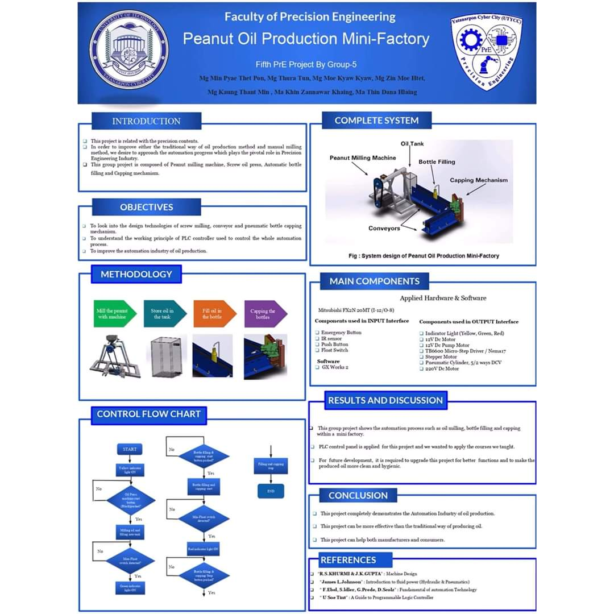
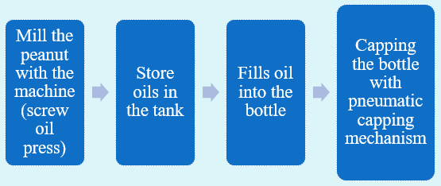
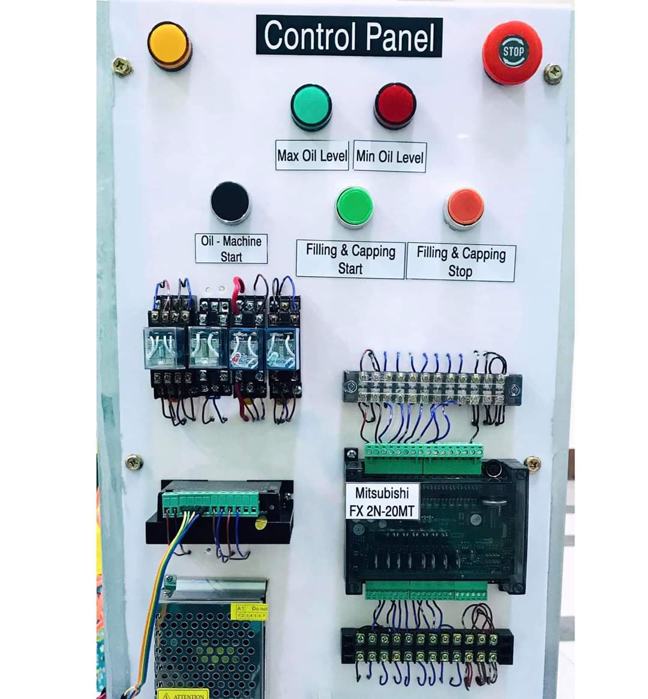
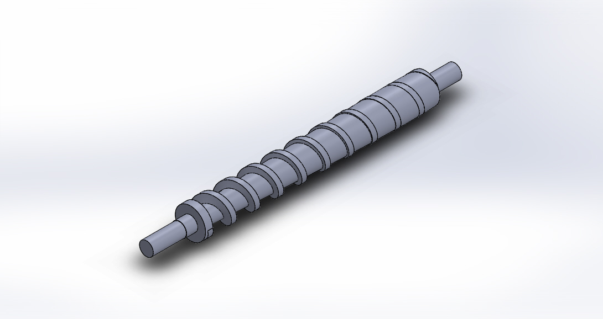
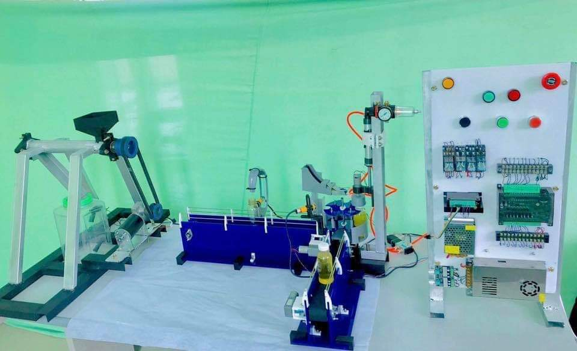

# Peanut-Oil-Production-Mini-Factory

This project is 5th year academic project and this is made by our project group including 10 members. We innovated `Peanut Oil Production Mini Factory` project and this project is awarded as `The Best Major Project of Mechanical Precision and Automation Engineering` of University project show and `Best Project Award of Faculty of Precision Engineering` in 2019 academic year. This project is composed of Peanut milling machine, screw oil press, automatic bottle filling and capping mechanism. The basic idea of innovating this project is to improve traditional and manual way of oil production to automation system for small business.

We divided "Design Team" and "Control Team" with 5 members for each team. I leaded the control team and we design automation process/sequence, implement electrical system and control system for the project. From this project, I got experiences of problem solving skills, critical thinking and team work. And I also got some experiences, basic knowledge and skills of electrical control, NO/NC concept, sequence control, PLC, ladder logic programming and CAD Design with Solidworks.

## Applied Hardwares and Software

PLC - Mitsubishi FX2N 20MT (I-12/ O-8)

Components used in Input Interfaces:
- Emergency Buttom                              
- IR Sensors
- Push Buttom                               
- Float Switch
                                
Components used in Output Interfaces:
- Indicator Light (Yellow, Green, Red)                           
- 12V Dc Motor                                  
- 12V Dc Pump Motor                            
- TB 6600 Micro Step Driver            
- Nema-17 Stepper Motor                 
- Pneumatics Cylinder, 5/2 ways DCV
                                     
Software - GX works2 (For PLC programming)

## Objectives
- To look into mechanical design of screw milling, conveyor design and pneumatic based bottle capping mechanism
- To understand the working principle of PLC controller used to control automation process
- To innovate automation industry for small business

## Operation Process

## Here is some pictures of the project

### System design in SOLIDWORKS

### Control system implementation

### Oil press screw design

### The whole system

# Thanks for enjoying this project!

!!! The resources/materials I provided in this repo is some of the resources in my laptop. The resources/materials in this repo is not all the materials of this project, there are just some of the materials.
